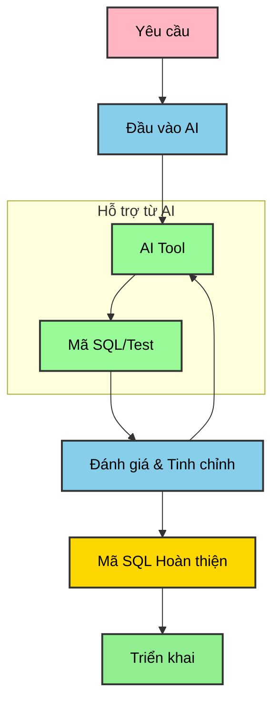
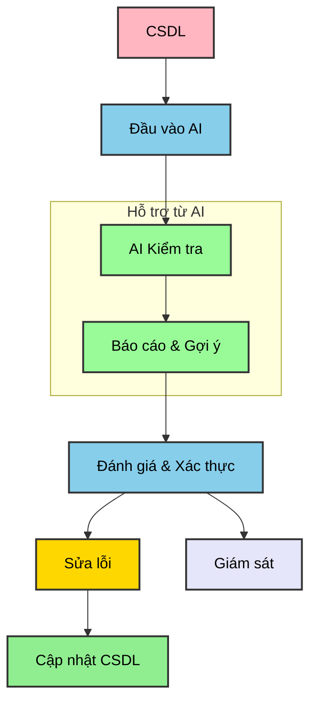
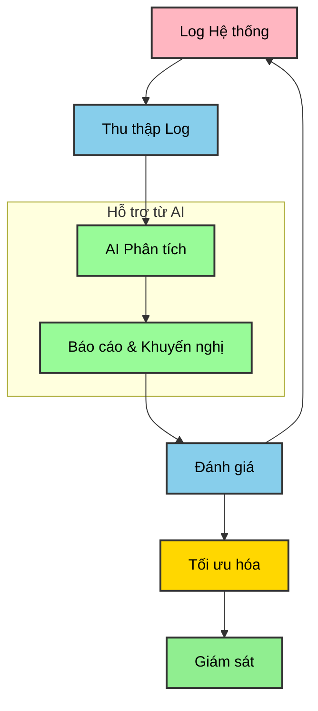

# Báo Cáo Kế Hoạch Ứng Dụng AI vào Công Việc Quản Trị Cơ Sở Dữ Liệu

**Người thực hiện:** Sơn
**Ngày:** 15 tháng 05 năm 2025

## 1. Giới Thiệu Nhanh

Em viết báo cáo này để trình bày kế hoạch áp dụng Trí tuệ Nhân tạo (AI) vào công việc quản trị cơ sở dữ liệu của mình. Mục tiêu là để công việc hiệu quả hơn, nhanh hơn và chất lượng hơn, bắt kịp xu hướng chung của ngành IT.

Hiện tại, em tập trung vào việc xây dựng và duy trì nền tảng dữ liệu cho hệ thống Backend, bao gồm việc thiết kế bảng, luồng dữ liệu, và viết các hàm, stored procedure.

## 2. Công Việc Chính và Định Hướng Dùng AI

Công việc của em bao gồm thiết kế schema, quản lý data flow, lập trình SQL, đảm bảo tính toàn vẹn dữ liệu và xử lý sự cố. Để tối ưu các việc này, em dự định sẽ tăng cường sử dụng AI, đặc biệt là các công cụ như Claude Sonnet mà em vẫn thường dùng để hỗ trợ viết code, tối ưu hóa các function và stored procedure SQL.

## 3. Tích Hợp AI vào Quy Trình Làm Việc

Em hình dung việc tích hợp AI vào các quy trình chính như sau:

### 3.1. Viết và Tối Ưu Mã SQL với AI (Claude Sonnet và các công cụ khác)

Khi có yêu cầu nghiệp vụ, thay vì viết tay toàn bộ, em sẽ dùng Claude Sonnet để phác thảo nhanh các câu lệnh SQL, function hoặc stored procedure. Sau đó, em sẽ review, tinh chỉnh và tiếp tục dùng Claude Sonnet để tối ưu hóa chúng.

### 3.2. Kiểm Tra Tính Toàn Vẹn Dữ Liệu bằng AI

AI có thể giúp quét và phát hiện các vấn đề về dữ liệu mà mắt thường hoặc các ràng buộc đơn giản có thể bỏ sót.

### 3.3. Phân Tích Log và Tối Ưu Hóa Cơ Sở Dữ Liệu

AI cũng có thể hỗ trợ phân tích log hệ thống để tìm ra các điểm cần tối ưu hoặc các dấu hiệu bất thường.

## 4. Công Cụ AI Chính và Cách Dùng

*   **Claude Sonnet:** Đây là công cụ em dùng thường xuyên và thấy rất hiệu quả để viết code SQL, tối ưu function, stored procedure. Em sẽ tiếp tục phát huy thế mạnh này.
*   **Các công cụ LLM khác (Copilot, ChatGPT, Gemini):** Có thể dùng bổ trợ cho Claude Sonnet để tham khảo thêm ý tưởng hoặc giải thích các đoạn code phức tạp khi cần.
*   **Công cụ chuyên biệt (AI2SQL, SQLAI.ai, Chat2DB):** Sẽ tìm hiểu và cân nhắc sử dụng cho các tác vụ đặc thù như tự động hóa SQL từ ngôn ngữ tự nhiên ở quy mô lớn hơn, hoặc kiểm tra sâu về tính toàn vẹn dữ liệu, phân tích log chuyên sâu.

## 5. Lợi Ích Chính

*   **Nhanh hơn:** Giảm thời gian viết code, tìm lỗi.
*   **Chất lượng hơn:** Code tối ưu hơn, dữ liệu sạch hơn.
*   **Tập trung hơn:** Có thêm thời gian cho các việc khó, mang tính chiến lược.

## 6. Một Vài Lưu Ý Nhỏ

*   **Prompt cho AI:** Cần học cách ra lệnh cho AI (viết prompt) thật chuẩn để nó hiểu đúng ý mình.
*   **Luôn kiểm tra lại:** AI chỉ là trợ lý, em vẫn là người quyết định cuối cùng và phải kiểm tra kỹ sản phẩm của AI.
*   **Bảo mật:** Cẩn thận khi dùng tool online, nhất là với dữ liệu nhạy cảm.

## 7. Đề Xuất Hỗ Trợ

Em mong công ty có thể hỗ trợ:

*   **Tài khoản Pro:** Nếu có thể, cấp tài khoản nâng cao cho Claude Sonnet hoặc các công cụ AI khác để khai thác tối đa tính năng.
*   **Đào tạo thêm:** Các khóa học ngắn về prompt engineering hoặc ứng dụng AI chuyên sâu cho database.

## 8. Kết Luận và Bước Tới

Em tin rằng việc dùng AI, đặc biệt là Claude Sonnet, sẽ giúp công việc quản trị database của em tốt hơn rất nhiều. 
